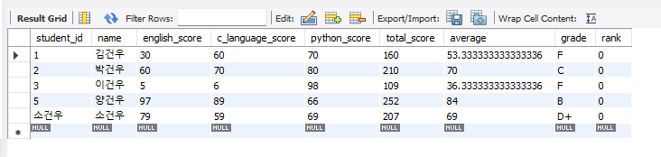
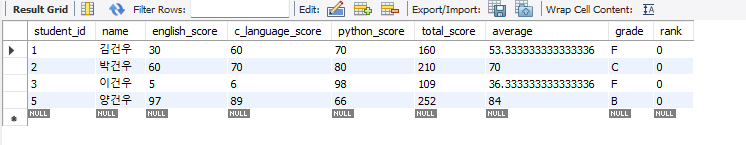
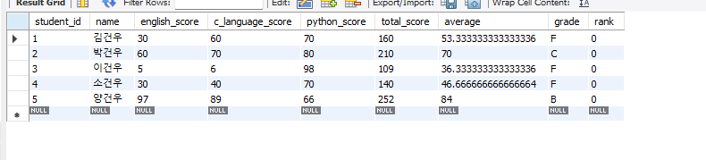
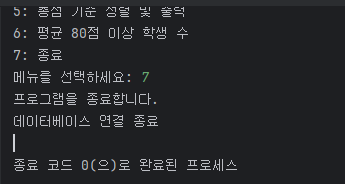
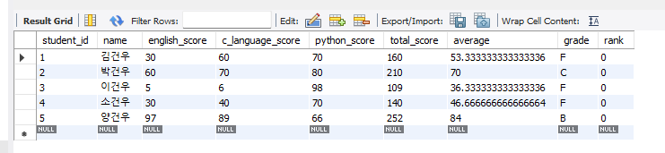

# 학생 성적 관리 프로그램입니다.

## 프로그램 개요

본 프로그램은 학생들의 성적을 효율적으로 관리하기 위해 개발되었습니다. 학번, 이름, 영어, C-언어, 파이썬 점수를 입력받아 총점, 평균, 학점, 등수를 계산하고, 데이터베이스에 저장하여 관리합니다.

## 주요 기능

*   **초기 설정**: 5명의 학생 정보를 초기 입력합니다.
*   **성적 출력**: 데이터베이스에 저장된 학생들의 성적 정보를 출력합니다.
*   **학생 추가**: 새로운 학생 정보를 입력받아 데이터베이스에 추가합니다.
*   **학생 삭제**: 학번을 입력받아 해당 학생 정보를 데이터베이스에서 삭제합니다.
*   **학생 검색**: 학번 또는 이름을 입력받아 학생 정보를 검색합니다.
*   **총점 기준 정렬 및 출력**: 학생 정보를 총점 기준으로 정렬하여 출력합니다.
*   **평균 80점 이상 학생 수**: 평균 점수가 80점 이상인 학생 수를 계산하여 출력합니다.

## 개발 환경

*   Python 3.x
*   PyMySQL 라이브러리

---
## 처음 5명 입력시 DB 상태

## 삭제시 DB 상태

## 학생 추가시 DB 상태

## 프로그램 종료시 DB 유지 

